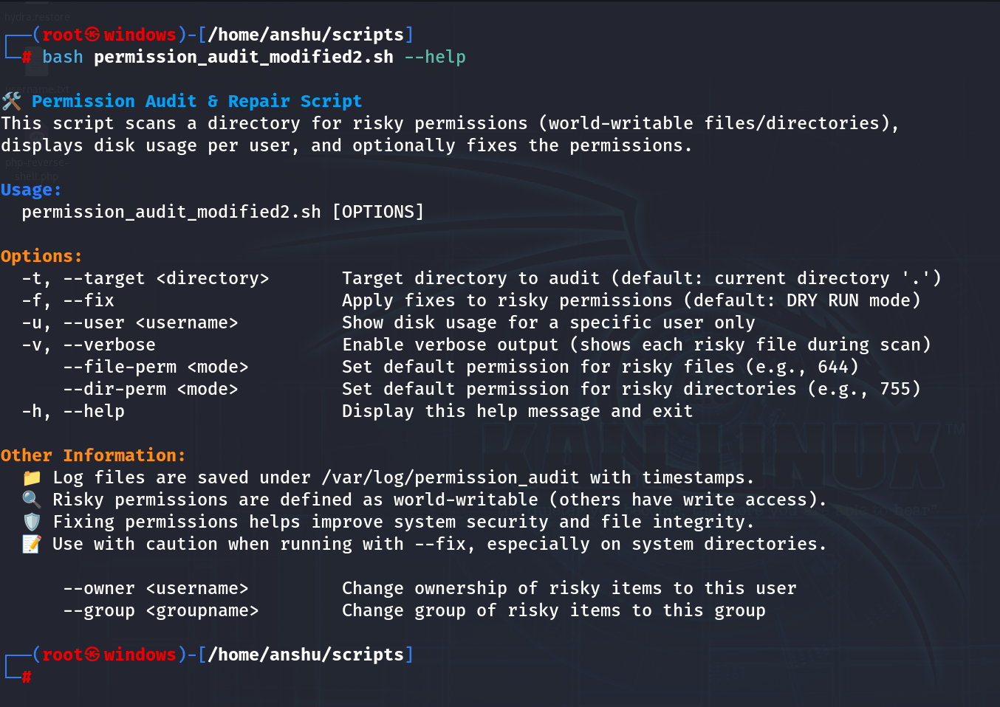
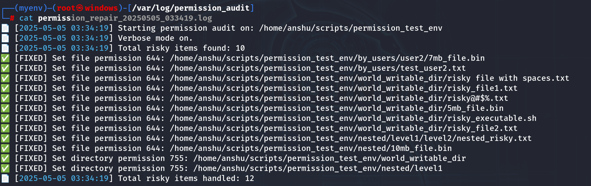
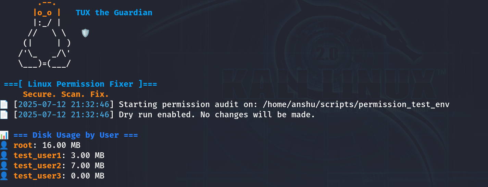

# 🔐 Linux Permission Scanner Utility


A lightweight Bash tool to **scan, detect, and fix insecure file and directory permissions** on Linux — with dry-run safety, logging, and customization.

---

## 📚 Table of Contents
- [Features](#-features)
- [Usage](#-usage)
- [Test Environment Setup](#-usage)
- [Demo/Video](#-usage)
- [Screenshots](#-screenshots)
- [Author & Links](#-author--links)
- [License](#-license)

---

## 🚀 Features

- 📁 Scan any target directory (`--target-dir`)
- 🧪 **Dry-run by default** – safe preview mode
- 🛠️ Apply secure fixes using `--fix`
- 📢 Show detailed output with `--verbose`
- 🔧 Set **custom permissions** for files/directories
- 👥 Change **ownership** to a specific user/group
- 📊 Display **disk usage per user**
- 🧾 Auto-generates logs in `/var/log/permission_audit`
- ℹ️ View help menu using `--help`

> 🔐 **Important:** This tool is intended to be run with `sudo` for full functionality and accurate permission changes.

---

## ⚙️ Usage

```bash
# Help menu
./permission_audit.sh --help

# Basic dry-run scan
./permission_audit.sh --target-dir /path/to/folder

# Apply fixes
./permission-audit.sh --target-dir /path/to/folder --fix

# Verbose + Fix
./permission_audit.sh --target-dir /path --fix --verbose

```


## 🧪 Test Environment Setup

Want to try out this tool without risking real data?

Run this script to generate fake test files, folders, and insecure permissions:

```bash
cd test-env/
chmod +x generate-test-files.sh
sudo ./generate-test-files.sh
```

---

## 🎥 Video Tutorial

Learn how to install, use, and get the most out of this tool in this full walkthrough video:

📺 [Watch on YouTube](https://youtube.com/watch?v=YOUR_VIDEO_ID)


## 📸 Screenshots

### 🧾 Help Menu (`--help`)
Quick overview of available flags and usage instructions.


---

### 📁 Log Output
Every scan is logged with a timestamp under `/var/log/permission_audit`.


---

### 📊 Disk Usage by User
Displays how much storage is consumed by each user on the system.



## 👨‍💻 Author & Links
Created with ❤️ by Diptanshu Dhawan

<a href="https://www.youtube.com/@HackWithDD" target="_blank">
  
</a>
<a href="https://www.instagram.com/i.diptanshu/" target="_blank">
  
</a>
<a href="https://x.com/DhawanDiptanshu" target="_blank">
  
</a>
<a href="https://linkedin.com/in/diptanshudhawan" target="_blank">
  
</a>

## 📄 License
MIT License – free to use, modify, and share 🙌


